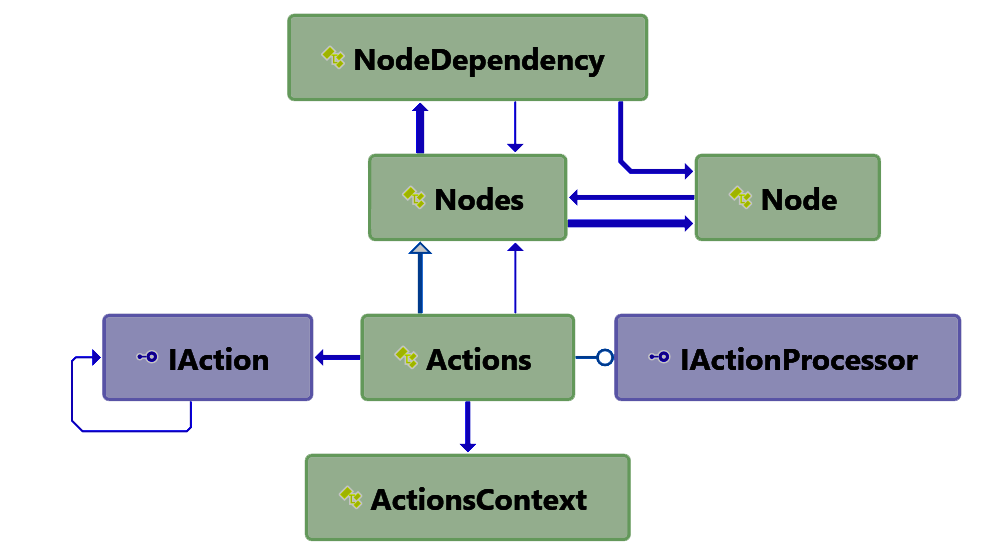

# J4JSoftware.TopologicalSort

This assembly provides:

- an implementation of a topological sort. These are sorts where the order is implicit in how the objects depend on each other. A common example is determining the build order for a multi-project solution when it's compiled.

- a system for organizing instances of classes which themselves each act on a collection of objects. I needed this for a complex database project where multiple objects had to be processed in multiple ways, but the sequence of processes had to be topologically sorted.

This assembly targets Net 7 and has nullability enabled.

The library repository is available on [github](https://github.com/markolbert/ProgrammingUtilities/blob/master/TopologicalSort/docs/readme.md).

The change log is [available here](changes.md).

- [J4JSoftware.TopologicalSort](#j4jsoftwaretopologicalsort)
  - [Topological Sort](#topological-sort)
  - [Topological Actions](#topological-actions)

## Topological Sort

There are two classes in this section, `TopologicalSorter` and `SortedCollection`.

- `TopologicalSorter` is a slightly tweaked version of [someone else's implementation of a topological sort](https://gist.github.com/Sup3rc4l1fr4g1l1571c3xp14l1d0c10u5/3341dba6a53d7171fe3397d13d00ee3f). I thank him for making it available!
- `SortedCollection` uses `TopologicalSorter` to sort, topologically, items you add to it. The sorted results are available through the `SortedSequence` property.

For `SortedCollection` to work you must implement the abstract method `SetPredecessors()`. That's where the predecessor/successor relationships which the topological sort needs to work are defined. You set the relationships by calling the protected method `SetPredecessor()`.

## Topological Actions

This system grew out of a need to process collections of Entity Framework Core database entities that were derived from analyzing/compiling-in-memory C# source code. For reasons I won't go into here the processing involved multiple steps which had to be done in a particular order because some later stages were dependent upon successful completion of earlier processing stages.

To make matters worse I kept having to add new processing steps. Keeping track of which ones had to come after which got to be a nightmare. So I put together the classes in this section to do it automagically for me. The diverse nature of the processing steps, however, necessitated a pretty generic approach...which makes it a bit abstract.

A picture may help:



The key player, from the point of view of using the system, is `Actions`. You use it by deriving your own subclass from it, overriding its `Initialize()` and `Finalize()` methods.

Calling the `Process()` method with a c ollection of objects will ensure those objects are processed by whatever actions you've defined in the correct topological order (i.e., honoring whatever dependencies there are among the
actions so that "earlier" stuff is always done before "later" stuff).

`Actions` is derived from `Nodes`, which is where the dependency relations between actions (nodes) is defined and maintained. You add actions to an instance of `Actions` by calling `AddIndependentNode()` or `AddDependentNode()` with the appropriate `IAction<TSymbol>` objects. Adding an action creates an instance of `Node<IAction<TSymbol>>` since its the `Node<>` wrapper which maintains the dependencies.

`IAction<TSymbol>` defines the following interface:

```csharp
public interface IAction<TArg> : IEquatable<IAction<TArg>>
{
    bool Process( IEnumerable<TArg> items );
}
```

That's what declares this particular kind of `Node<>` can process an enumerable collection of a particular kind of object.

Information which needs to be made available to the `Initialize()`, `Process()` and `Finalize()` methods can be provided by deriving a class from `ActionsContext` and supplying it in the `Actions` constructor. It gets assigned to the `Context` property.

`ActionsContext` itself provides a single property, `StopOnFirstError`, which is used to control whether or not the failure of an individual action causes the entire sequence of actions to abort.

When you call `Prcoess()` on an instance of `Actions` (supplying an `IEnumerable<>` of whatever objects you want processed) several things happen in sequence:

- Any `Initialize()` method you've defined on your subclass is invoked on the collection of items to be processed (the default method does nothing and returns `true`). If that method fails the `Process()` call will stop and return `false`.
- The actions you defined are sorted topologically. If the topological sort fails -- perhaps because you accidentally defined a circular loop of dependencies -- the error will be logged and the `Process()` method will return `false`.
- The sorted actions will be executed in sequence against the collection of supplied items. The success or failure of the actions is accumulated as part of an overall return value. If you've set `ActionsContext.StopOnFirstError`
to `true` the failure of any individual action will cause `Process()` to return as `false`.
- Finally, whatever `Finalize()` method you've defined is run on the collection of supplied items. Its success or failure is accumulated on top of the success or failure of the individual actions.

If everything succeeded `Process()` will return `true`. Otherwise it returns `false`.
